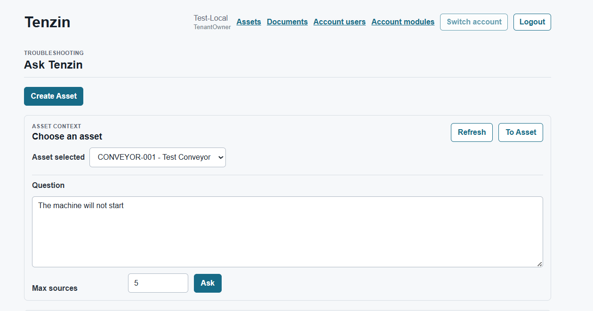
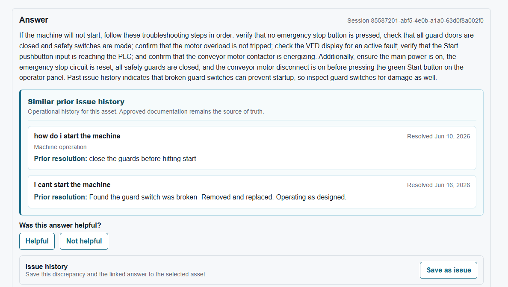
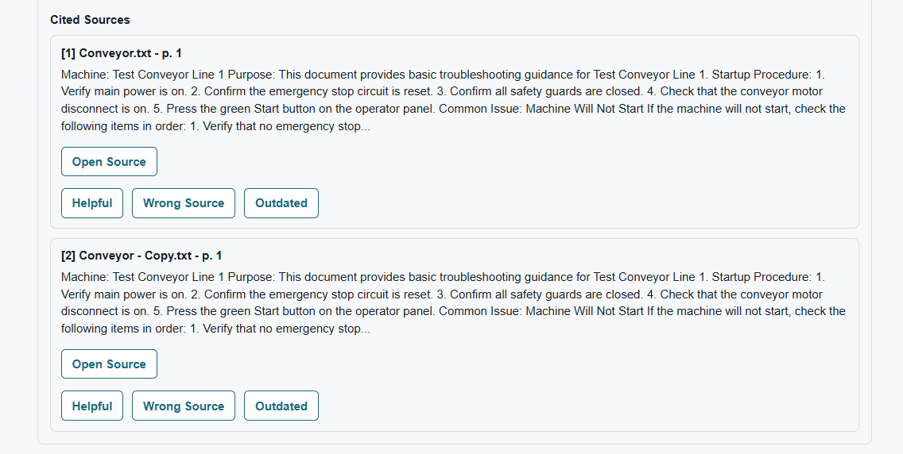

# Tenzin MaintenanceIQ — Public Technical Case Study

> A sanitized engineering portfolio repository for an active SaaS product build.  
> Production source code is private. This repository documents the product architecture, design decisions, implementation slices, verification discipline, and technical tradeoffs behind the platform.

## What this is

Tenzin MaintenanceIQ is a SaaS application concept and active build focused on helping industrial maintenance teams find machine knowledge faster, troubleshoot equipment issues, and preserve tribal knowledge with AI-assisted answers grounded in cited documentation.

The platform is designed for plants, machine builders, integrators, and maintenance teams that need a practical way to connect machine assets, components, manuals, PLC/HMI/VFD program files, troubleshooting notes, maintenance issues, and cited AI assistance.

## For customer and pilot readers

Tenzin MaintenanceIQ is a cited maintenance knowledge assistant for helping teams find answers inside equipment documentation. It is designed to support maintenance, reliability, operations, and technical leaders who need faster access to trusted machine knowledge without replacing technicians, engineers, OEM manuals, safety procedures, or existing CMMS/EAM systems.

### What it does

- Organizes approved equipment documentation around accounts, facilities, assets, and maintenance issues.
- Lets users ask plain-language maintenance questions tied to asset context.
- Returns source-backed answers with citations so users can open the cited manual page.
- Captures feedback and issue context so teams can learn which references were useful.
- Keeps account and facility data boundaries visible in pilot conversations.

### Why it matters

Maintenance teams often lose time searching through PDFs, binders, shared drives, and tribal knowledge during troubleshooting. Tenzin is intended to help teams find relevant documentation faster, verify answers against original sources, and preserve useful troubleshooting context for future work.

### Customer-facing collateral

- [One-page customer overview](docs/customer-facing/tenzin-one-page-overview.md)
- [Pilot collateral packet](docs/customer-facing/README.md)
- [Pilot discovery questions](docs/customer-facing/pilot-discovery-questions.md)
- [Demo script](docs/customer-facing/demo-script.md)
- [Pilot success criteria](docs/customer-facing/pilot-success-criteria.md)
- [Customer-facing system overview diagram](assets/diagrams/tenzin-maintenanceiq-system-overview.png)

Pilot success criteria are framed as goals to validate during a focused pilot, not guaranteed outcomes.

## Diagrams

- [System Context](assets/diagrams/system-context.md)
- [Domain Model](assets/diagrams/domain-model.md)
- [AI / RAG Citation Flow](assets/diagrams/rag-citation-flow.md)

## Screenshots

The screenshots below use sanitized demo data and are intended to show product workflows without exposing private source code, customer data, secrets, or internal implementation details.

### Ask Tenzin



Machine-specific AI question workflow scoped to a selected industrial asset.

### AI Answer Summary



AI-assisted troubleshooting response with similar prior issue history and maintenance workflow actions.

### Cited Sources



Citation-first answer support with source cards and feedback controls for citation quality.

## What this repo proves

This public repo is intentionally not a source-code dump. Instead, it shows how the system is designed and built at an engineering level:

- Product and workflow overview
- SaaS architecture
- Backend/API design
- Domain model and boundaries
- Tenant isolation and DTO safety
- AI/RAG and citation workflow
- MaintenanceIQ issue/timeline workflow
- Implementation checkpoint logs
- Verification gates and engineering discipline
- Architecture Decision Records

## Why the source code is private

The production codebase is private because Tenzin is an active commercial product build. The public case study avoids exposing source code, secrets, implementation details that could weaken security, or future product IP. The goal is to demonstrate engineering ownership, system design, and implementation judgment without publishing the private repository.

## Technology stack

| Area | Technology |
| --- | --- |
| Backend | .NET 8, ASP.NET Core Web API |
| Frontend | Angular 19, TypeScript |
| Database | PostgreSQL, EF Core 8 |
| Storage | Azure Blob Storage / Azurite for local development |
| AI | Provider abstraction for LLM-backed assistance |
| Search/RAG | Document chunking, embeddings, cited retrieval workflow |
| Hosting target | Azure App Service initially |
| Architecture | Modular monolith with domain-oriented slices |

## Repository guide

| File | Purpose |
| ---- | ------- |
| [Product Overview](docs/01_product_overview.md) | What the product does and who it helps |
| [Architecture Overview](docs/02_architecture_overview.md) | System shape, modules, and runtime flow |
| [Domain Model](docs/03_domain_model.md) | Sanitized entity map and boundaries |
| [API Surface](docs/04_api_surface.md) | Example public API areas without implementation source |
| [Security & Tenancy](docs/05_security_and_tenancy.md) | Tenant isolation, DTO safety, auth/account boundaries |
| [AI, RAG & Citations](docs/06_ai_rag_and_citations.md) | AI answer flow, citations, feedback, abstraction |
| [MaintenanceIQ Workflows](docs/07_maintenanceiq_workflows.md) | Asset-scoped issue, timeline, and attachment workflows |
| [Implementation Log](docs/08_implementation_log.md) | Completed engineering slices and what changed |
| [Verification](docs/09_verification.md) | Build, test, frontend, and quality gates |
| [Roadmap](docs/10_roadmap.md) | Near-term and future product direction |
| [Resume and LinkedIn Blurbs](docs/11_resume_and_linkedin_blurbs.md) | Public-facing project descriptions for job search use |
| [Interview Walkthrough](docs/12_interview_walkthrough.md) | Guided explanation for recruiter screens, interviews, and technical walkthroughs |
| [Customer-Facing Collateral](docs/customer-facing/README.md) | One-page overview, pilot discovery questions, demo script, and pilot success criteria |
| [Tenzin MaintenanceIQ One-Page Overview](docs/customer-facing/tenzin-one-page-overview.md) | Concise customer-facing product overview for pilot and sales conversations |
| [Customer-Facing System Overview](assets/diagrams/tenzin-maintenanceiq-system-overview.png) | Simple public diagram showing how Tenzin connects users, documents, retrieval, citations, and source opening |
| [System Context Diagram](assets/diagrams/system-context.md) | High-level system context rendered with Mermaid |
| [Domain Model Diagram](assets/diagrams/domain-model.md) | Simplified domain relationship diagram rendered with Mermaid |
| [AI / RAG Citation Flow](assets/diagrams/rag-citation-flow.md) | Sequence diagram for cited AI answer generation |
| [Screenshot Plan](assets/screenshots/README.md) | Planned sanitized screenshots and safety checklist |
| [ADRs](docs/adr/) | Architecture Decision Records |


## High-level system map

```text
Tenant / Account
 ├── Users
 ├── Assets / Machines
 │    ├── Machine Components
 │    ├── Documents
 │    │    ├── Pages
 │    │    ├── Chunks
 │    │    └── Embeddings
 │    ├── Maintenance Issues
 │    │    ├── Timeline Events
 │    │    └── Attachments
 │    └── Program Loads / Disaster Recovery Artifacts
 ├── Chat Sessions
 │    ├── Chat Messages
 │    └── Answer Citations
 └── Feedback
      ├── Answer Feedback
      └── Citation Feedback
```

## Current implementation themes

The private implementation is being developed in slices with verification gates after each meaningful change. Recent completed areas include:

- MaintenanceIQ issue timeline foundation
- Actor display safety for timeline events
- Read-only attachment view/download behavior
- Attachment archive workflow
- Feedback boundary hardening
- DTO response safety improvements
- AccountId terminology on public auth/session responses
- AI feedback type restriction and validation
- Frontend state cleanup and issue-view polish

## Portfolio usage

This repository is meant to be shared with recruiters, hiring managers, and technical interviewers as a public engineering artifact. It supports discussions around:

- Senior .NET backend design
- Full-stack SaaS architecture
- Angular + ASP.NET Core product delivery
- AI-enabled industrial software
- Multi-tenant system boundaries
- Secure DTO/API design
- Practical verification discipline
- Product-minded engineering ownership

## License

All rights reserved. This repository is provided for portfolio and evaluation purposes only. No source code license is granted.
