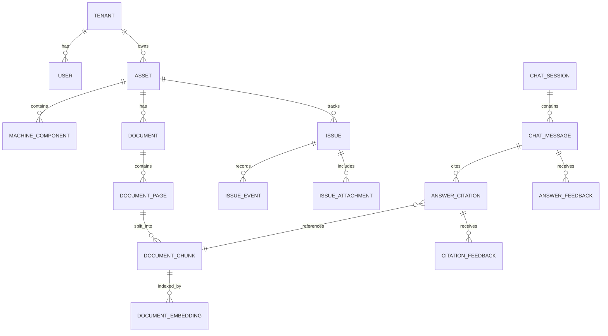

# Domain Model

This diagram shows a simplified, sanitized version of the main domain relationships.

## Notes

The platform centers on industrial assets and machine-specific knowledge.

Core areas include:

- Tenants and users
- Assets and machine components
- Documents, pages, chunks, and embeddings
- Chat sessions, messages, and citations
- Maintenance issues, timelines, and attachments
- Answer-level and citation-level feedback

The actual production schema and source code are private. This diagram intentionally presents a simplified public model.