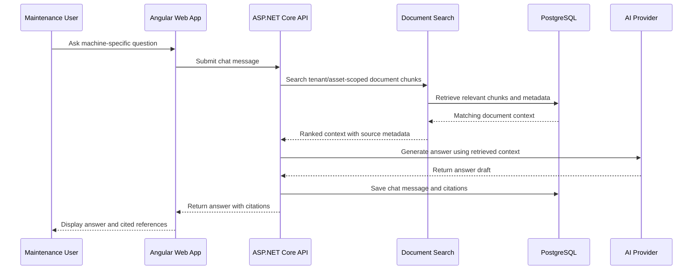

# AI / RAG Citation Flow

This diagram shows the simplified flow for machine-specific AI answers with citations.

## Notes

The design goal is not just to generate an answer. The goal is to return an answer that can be traced back to source documentation.

This supports maintenance teams that need practical troubleshooting help while still being able to verify the source material behind the response.