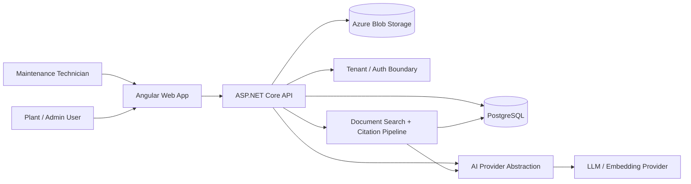

# System Context

This diagram shows the high-level system context for Tenzin MaintenanceIQ.

## Notes

Tenzin MaintenanceIQ is designed as a tenant-aware SaaS application for industrial machine knowledge, troubleshooting, cited AI answers, and maintenance workflows.

The public case-study repository does not include source code. It documents the architecture, domain boundaries, implementation approach, and verification process for employer review.