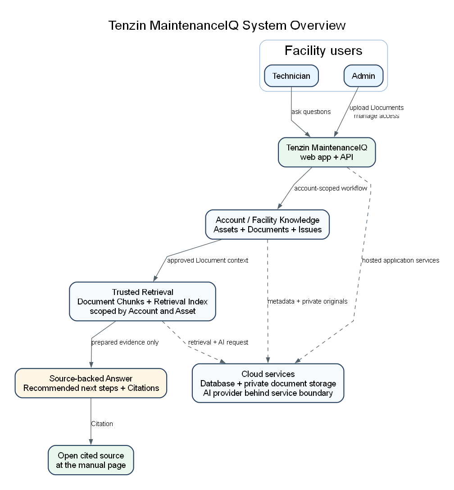

# Tenzin MaintenanceIQ Customer Overview

Tenzin MaintenanceIQ is an industrial maintenance knowledge assistant that helps plant teams ask plain-language questions and get answers grounded in their own equipment documentation, with citations back to the source.

## The Problem

Maintenance knowledge is often scattered across PDFs, binders, shared drives, OEM manuals, notes, and technician experience. When equipment is down or acting up, teams can spend valuable time hunting for the right procedure, fault code, page, or prior troubleshooting context.

## What Tenzin MaintenanceIQ Does

Tenzin MaintenanceIQ helps technicians, maintenance managers, reliability teams, and facility operators:

- Ask questions in plain language.
- Get answers grounded in your own equipment documentation.
- Open the cited manual page behind the answer.
- Organize knowledge around accounts, facilities, assets, documents, and issues.
- Support technicians without replacing engineering judgment, safety procedures, OEM manuals, a CMMS or EAM, or the maintenance team.

## How It Works

1. An Admin or Technician uploads approved equipment documents and links them to assets.
2. Tenzin MaintenanceIQ extracts source pages, creates chunks, and prepares retrieval indexes for search.
3. A Technician asks an asset-specific question.
4. Tenzin MaintenanceIQ retrieves relevant source material from the current account and facility context.
5. The answer returns practical guidance with citations and links back to the source page.

See the technical flow: [Document ingestion and retrieval flow](../../assets/diagrams/tenzin-maintenanceiq-document-rag-flow.png).

## Why Citations Matter

Tenzin MaintenanceIQ is designed to help teams find and use existing knowledge faster. Citations keep answers traceable: users can inspect the cited manual page, compare the response against approved documentation, and mark which references were helpful. If reliable source material is not found, the system should say it does not have enough information rather than inventing a procedure.

## Security And Data Boundaries

Tenzin MaintenanceIQ is designed with security and data separation in mind. Knowledge is organized by account and facility, with scoped access controls so normal users work only with information they are authorized to see. Source documents are opened through authenticated application paths rather than public file links.

See the trust diagram: [Account / Facility data boundary](../../assets/diagrams/tenzin-maintenanceiq-data-boundary.png).

## Best-Fit Pilot Use Cases

- High-value or frequently serviced assets with large manuals.
- Troubleshooting recurring faults, alarms, or symptoms.
- Helping newer technicians find the right documentation faster.
- Reducing time spent searching PDFs, binders, and shared drives.
- Capturing issues and useful source references for future troubleshooting.

## Suggested Pilot Outcome

A focused pilot should validate whether Tenzin MaintenanceIQ helps a facility reduce documentation search time, improve source traceability, and support technicians during real troubleshooting workflows. Start with a small set of assets, approved documents, and practical questions, then review answer quality, citation usefulness, and technician feedback before expanding.
